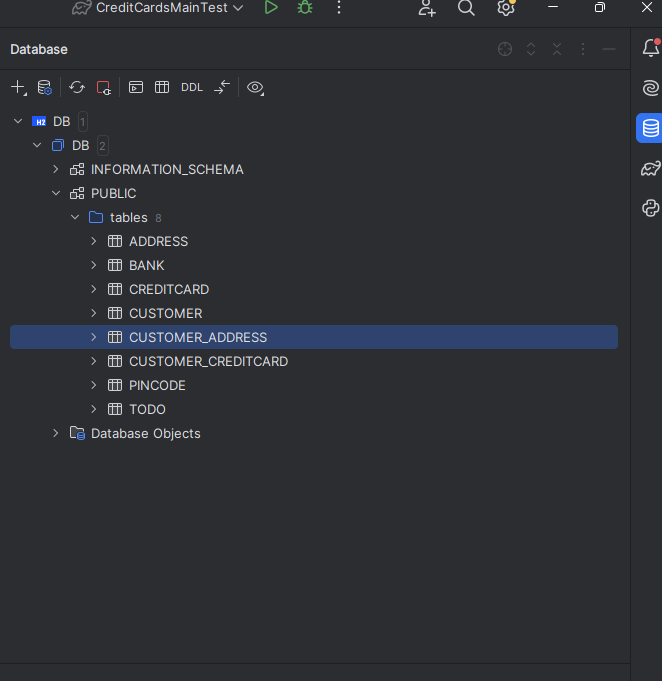

Had no problems during the installation. Had a technical problem where the address.getOwners() and bank.getOwnedCards() 
returns a collection, while the tests expects a set. Edited the methods to convert the collection to a set to pass the 
assertEqual test. Struggled a bit with the annotation for the bidirectional association, but I think I figured it out. 
I have no pending issues with this assignment. 

Used IntelliJ's tool to view the created tables. The created tables are shown in the screenshot.

